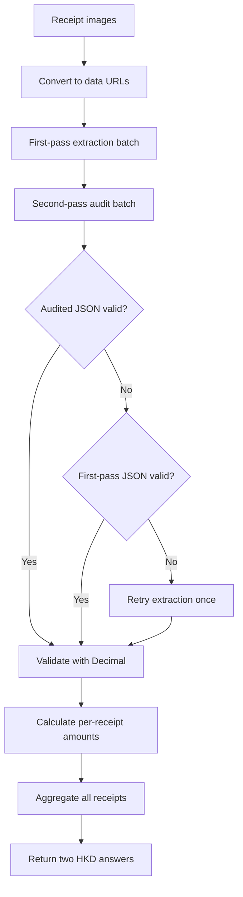

# FTEC5660 Homework 1: Receipt Chain

Build a LangChain pipeline that reads every supermarket receipt in a folder
with the vision-capable DeepSeek Flash model and answers these two questions:

1. How much money did I spend in total for these bills?
2. How much would I have had to pay without the discount?

For this homework, **amount spent** means the final payment after the receipt's
rounding line. **Without the discount** means the sum of the original positive
item prices: add back every promotion, coupon, member, app, packaging-damage,
and percentage discount, but do not add back rounding.

## Student task

Only edit the two functions in `hw1.py` that contain `### YOUR CODE HERE`:

- `build_chain()` creates your LangChain chain.
- `answer_queries()` runs the chain on the receipt images and returns one final
  response for each question.

You may use prompt chaining, routing, parallel calls, reflection, or a
combination. Your final responses should each contain one HKD amount. Do not
hard-code filenames or public answers; grading uses unseen receipt folders.

## Setup and public test

```bash
python3 -m venv .venv
source .venv/bin/activate
pip install -r requirements.txt
```

Put your DeepSeek key after `DEEPSEEK_API_KEY=` in `.env`, then run:

```bash
python3 hw1.py --image-folder public_test
```

The program creates `results.csv` in the current directory. Its columns are
`query`, `model_response`, and `correctness`. The public answers are in
`public_test/ground_truth.json`. The starter intentionally returns the dummy
response `please design your chain to answer these two queries.` so it runs
before you add any API code.

The required model is `deepseek-v4-flash-vision-exp`, the vision-capable
DeepSeek Flash model. JPEG, PNG, GIF, and WebP inputs are accepted by the
homework runner.


## Homework 1 solution: 

### Pipeline design



### Solution description

The solution uses a two-pass multimodal LangChain pipeline. `build_chain()`
creates one `ChatDeepSeek` model using
`deepseek-v4-flash-vision-exp` and connects it to two
`ChatPromptTemplate` pipelines. The extraction pipeline reads each receipt
image and returns a compact JSON object containing `paid`, `subtotal`, and
`discounts`. The audit pipeline receives both the original image and the
first-pass draft, re-reads the receipt independently, and corrects missing,
duplicated, or misclassified monetary entries.

`answer_queries()` converts every local image to a data URL and processes the
receipts in parallel with a maximum concurrency of four. The audited response
is preferred, while the first-pass response and one independent retry provide
fallbacks when an output is invalid. Model responses are parsed as JSON and
all monetary values are converted to `Decimal`, avoiding binary floating-point
rounding errors. The parser also checks that `paid` and `subtotal` differ by no
more than HK$0.50, since their difference should only be the receipt's rounding
adjustment.

For each receipt, the amount spent is the final `paid` value. The amount
without discounts is computed deterministically as `subtotal + sum(discounts)`.
Discount values are converted to positive magnitudes, while rounding, change,
cash tendered, card balances, loyalty points, and duplicated payment records
are excluded by the prompts. Finally, the per-receipt values are summed and
returned as two strings containing exactly one HKD amount each.

